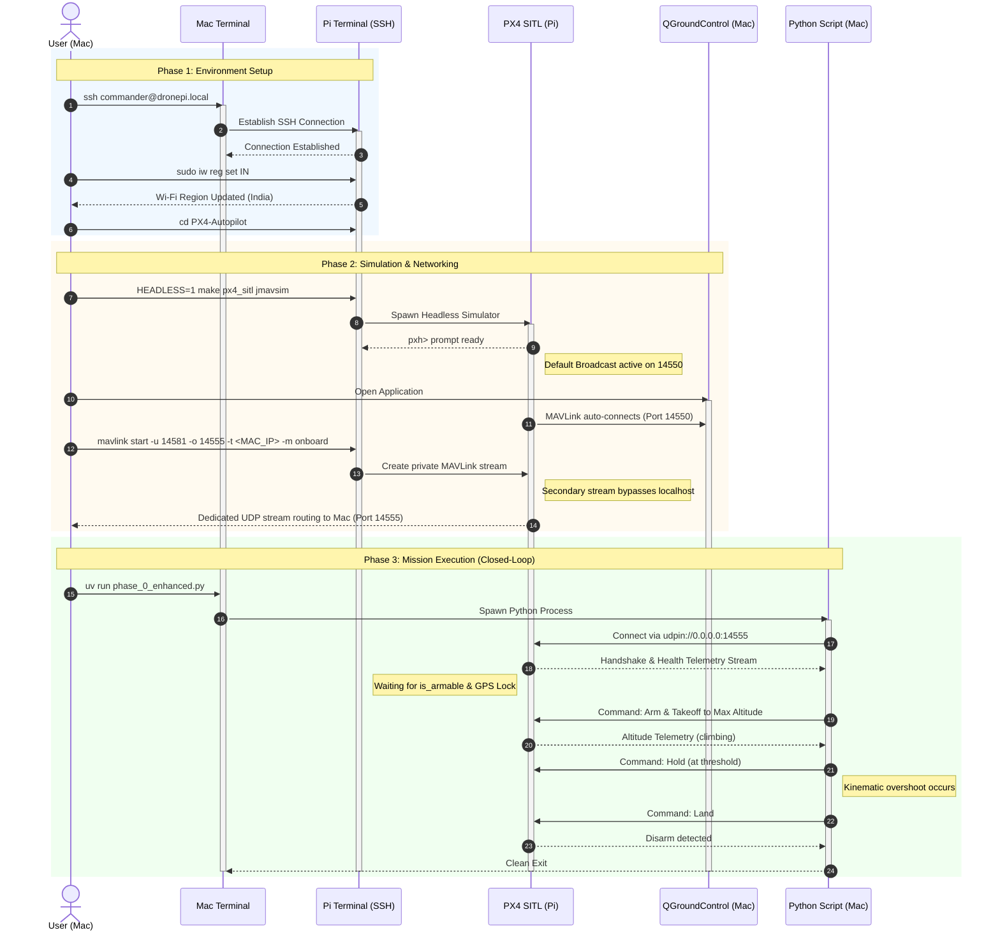

##  Phase 0 — Setup, Validation & Basic Autonomy

### Overview - 
This phase establishes the foundational infrastructure for autonomous UAV control using PX4 SITL (Software-In-The-Loop) and MAVSDK-Python. It establishes reliable MAVLink communication, monitor vehicle health telemetry, and execute closed-loop flight state transitions (Arm, Takeoff, Hover, Land).

### Prerequisites - 

**Flight Stack:** PX4 Autopilot (Running on Raspberry Pi / Linux)

**API:** MAVSDK-Python (pip install mavsdk asyncio)

**GCS:** QGroundControl (Running on Host Mac/PC)

> [!NOTE]
> To get PX4 Up and Running and Connected to Mac -> Refer this [Article](https://tejasjm.com/blog/px4-sitl) 

### Architecture & Network Routing - 

Running the simulator on a remote machine (Raspberry Pi) and the execution script on a host machine (Mac). I Faced some problems while using the PX4 broadcast parameters  and had port collisions with QGroundControl (which aggressively hogs port 14550).

So to run both QGC and the Python script simultaneously, I utilise Direct IP Targeting to create a private MAVLink stream.

**The Routing Bypass -**

Instead of modifying broadcast parameters, I simply route a secondary MAVLink instance directly to the host machine's IP address using a custom port (14555), leaving 14550 free for QGC.


### Execution Scripts -
This phase contains two scripts demonstrating different levels of control logic.

1. ***phase_0_simple.py*** (Open-Loop / Timed)
A "fire-and-forget" script. It polls the core.connection_state() and telemetry.health() streams to ensure the EKF is settled and a GPS lock is achieved (is_global_position_ok and is_armable). It then commands a takeoff, sleeps the Python thread for 10 seconds, and commands a landing.

2. ***phase_0_enhanced.py*** (Closed-Loop / Telemetry Feedback)
A closed-loop profile. Instead of relying on blind timers, it actively monitors the drone.telemetry.position() stream.

Modifies the default PX4 takeoff altitude to Maximum Altitude.

Actively polls position.relative_altitude_m.

Dynamically triggers the hold() command only when the physical telemetry proves the vehicle has crossed the threshold.

### 📊 Deliverables & Proof of Execution - 

**Flight Review Log:** [PX4 Logs](https://logs.px4.io/plot_app?log=42c1b618-a42e-443c-a7bb-f30c7f475269)

**Project Working Snippet -**


### 💻 Usage

Command Sequence - 

```
# 1. Login
ssh commander@dronepi.local

# 2. Fix Wi-Fi Regulation (Run every boot)
sudo iw reg set IN

# 3. Enter Directory
cd PX4-Autopilot

# 4. Start Simulation (Headless)
HEADLESS=1 make px4_sitl jmavsim

# 5. Connection Bind to Mac (pxh>)
mavlink start -u 14581 -o 14555 -t <MAC_IP> -m onboard

# 6. Open QGroundControl in Mac

# 7. Run Program in Mac -
uv run phase_0_enhanced.py
```

Workflow -
 
